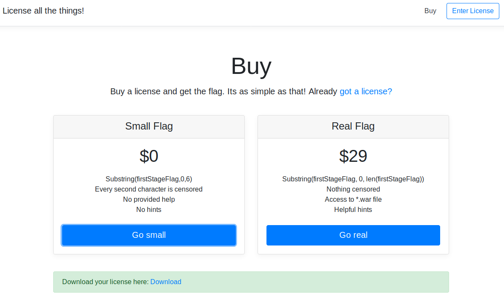
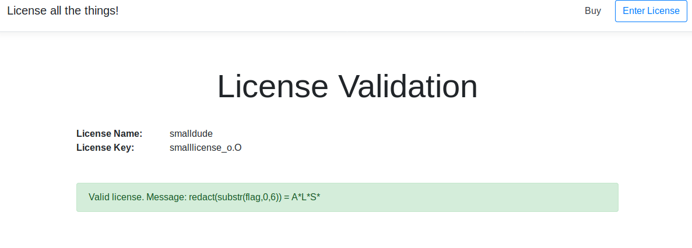

# licpwn stage1
A simple/medium crypto challenge. The goal is to get the IV of the AES encryption method in order to serialize a forged object. The IV is the flag. Once a valid license object was sent, the WAR file is provided for stage2. 

## Description
The site offers a simple bootstrap webpage as shown below. It offers the user to buy some flags, but its acctually all about the licensing system.


Using the provided license the user receives the "redeaced" flag. But he got a valid license.



## Solution
First of all the user should see the HTML comment with valid license data:
```
<!-- We got a backup license from earlier. Username: ALLES! LicenceCode: e0657c850d30211e27afe6c6edb3822c -->
```

Using the stacktraces the user can understand the encrypted file format: The key are the first 16 bytes, followed by the binary encrypted data. Using the scheme for cbc decryption the user can guess the IV using the known plaintext:
https://upload.wikimedia.org/wikipedia/commons/2/2a/CBC_decryption.svg

The known plaintext is the java object header `0xaced`, Version 5 `0x0005`, as well as the TC_OBJECT and TC_CLASSDESC  constants `0x73` and `0x72`, followed by `0x00`. The 8th byte is unknown, but can be brute forced easily. The java serilialized object is followed by the package name, which is also leaked in the stacktrace: `com.licp`. See: https://docs.oracle.com/javase/8/docs/platform/serialization/spec/protocol.html

Using the information the IV can be guessed using the script of localo:


```
from Crypto.Cipher import AES

data = None
with open('small.lic') as f:
	data = f.read()

key = data[:16]
message = data[16:]

fake_iv = message[:16]
fake_message = message[16:]

cipher = AES.new(key, AES.MODE_CBC, fake_iv)
dec  = cipher.decrypt(fake_message)

print("decrypted: ")
print(dec.encode('hex'))


data = '\xAC\xED\x00\x05\x73\x72\x00'
data+= '\xFF' #This byte needs to be guessed
data+='com.licp'

guess_idx = 7

cipher = AES.new(key, AES.MODE_CBC, '\x00'*16)
dec2  = cipher.decrypt(message)

a=""
for i in range(len(data)):
	a+= chr(ord(data[i])^ord(dec2[i]))

iv = a

print("partial IV: ")
print(iv)

plain = "A"*16

cipher = AES.new(key, AES.MODE_CBC, fake_iv)
dec2  = cipher.encrypt(plain)
print("Recrypt: ")

new_ciphertext = (fake_iv+dec2)

print(new_ciphertext.encode('hex'))

IV = "ABCDBBCD01230123"
cipher = AES.new(key, AES.MODE_CBC, IV)
new_plain = cipher.decrypt(new_ciphertext)
print(new_plain.encode('hex'))
```


With a valid license the WAR file can be downloaded:


Flag: `ALLES{a3s_st4g3}`

Done :)