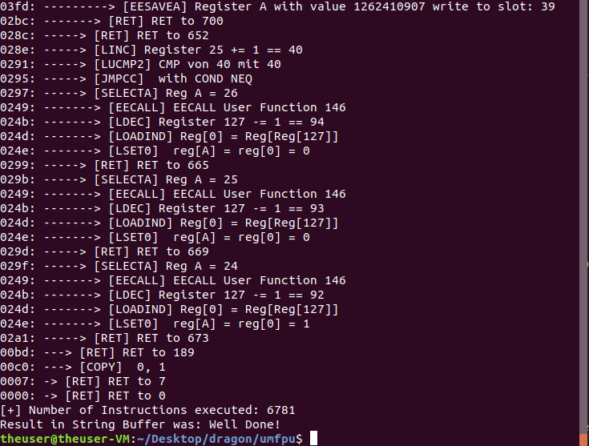

# ummmfpu

Check out gynvaels [code and solution](https://github.com/gynvael/random-stuff/tree/master/teaser_dragon_ctf_2019/ummmfpu) first :) He's the author of this amazing challenge.

Unfortunatly I didn't solve this task during the ctf. I had some minor bugs in my implementation, causing a crash at the `read_slot` and `write_slot` functions. Furthermore I didn't realize that jumps are starting from the function base offset. The frustation got me and I tried to solve other tasks. But I learned my lesson to read the instruction documentation more attentively. 

Anyways, today I finished my umFPU emulator which has all the necessary instructions and matrix operations for this challenge. It correctly validates the flag. The conditional jumps are super messy and a few hacks were nessecary, but all I'm quite happy the emulator.

Thanks for the great challenge!

Emulator in Action:

